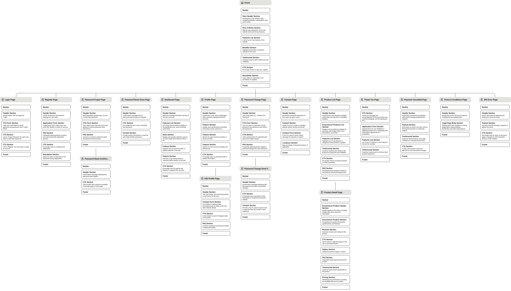
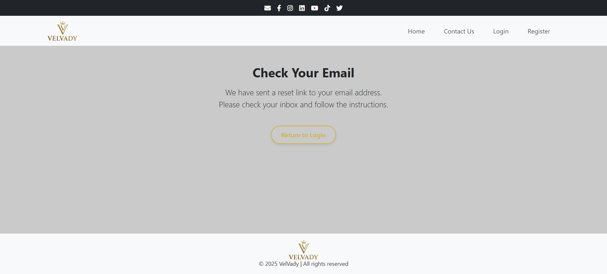
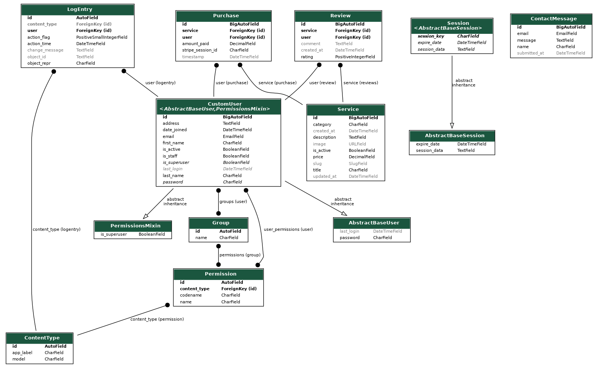

# VelVady | Digital Service Marketplace

VelVady is a modern, full-stack e-commerce platform developed using Django, Stripe, and PostgreSQL. Designed as a digital service marketplace, it enables users to explore, review, and securely purchase personalised services online. From CV optimisation to design work, VelVady offers a streamlined solution for discovering and managing high-quality, one-time digital services.

The platform focuses on delivering a responsive, secure, and user-friendly experience. It integrates a dynamic dashboard, Stripe-powered payments, an automated order confirmation system, and a full review engine. VelVady has been developed using best practices in full-stack development and is fully responsive across devices.

---
---
---

## Live Site

[https://velvady-app-b7f67234cb3b.herokuapp.com/](https://velvady-app-b7f67234cb3b.herokuapp.com/)

## Repository

[https://github.com/MH-LIKHON/VelVady](https://github.com/MH-LIKHON/VelVady)

---
---
---

## Table of Contents

1. [Project Overview](#velvady--digital-service-marketplace)  
2. [User Experience (UX)](#user-experience-ux)  
   - [Project Goals](#project-goals)  
   - [User Stories](#user-stories)  
   - [Feature Prioritisation](#feature-prioritisation)  
   - [Technologies Used](#technologies-used)  

3. [Features](#features)  
   - [Page-by-Page Feature Summary](#page-by-page-feature-summary)  
   - [Stripe Checkout Flow](#stripe-checkout-flow)  
   - [Webhook Handling](#webhook-handling)  
   - [Admin Panel Overview](#admin-panel-overview)  
   - [Responsiveness and Accessibility](#responsiveness-and-accessibility)  

4. [Media and Screenshot Index](#media-and-screenshot-index)  
5. [Security and Performance Considerations](#security-and-performance-considerations)  

6. [Testing](#testing)  
   - [Manual Testing](#manual-testing)  
   - [Device and Browser Testing](#device-and-browser-testing)  
   - [Bugs and Fixes](#bugs-and-fixes)  
   - [Lighthouse and Validation](#lighthouse-and-validation)  
   - [Known Issues](#known-issues)  

7. [Models and Database Design](#models-and-database-design)  
   - [Model Structure](#model-structure)  
   - [Entity Relationships](#entity-relationships)  

8. [Deployment](#deployment)  
   - [Local Setup](#local-setup)  
   - [Production Deployment](#production-deployment)  
   - [Environment Variables and Stripe Keys](#environment-variables-and-stripe-keys)  

9. [Credits](#credits)  
10. [Acknowledgements](#acknowledgements)

---
---
---

## User Experience (UX)

### Project Goals

VelVady was developed as a full-stack e-commerce platform with a specific focus on digital service delivery. The project was designed to simulate a real-world SaaS product offering personalised, one-time services that can be purchased securely and managed via a user dashboard.

The core objectives were:
- To create a responsive and intuitive interface suitable for both desktop and mobile users.
- To implement a reliable Stripe-powered checkout experience for one-click purchases.
- To ensure that each successful payment automatically stores a transaction and confirms it via email.
- To provide users with the ability to leave service reviews, access a personal dashboard, and manage their account securely.

The platform was also intended to demonstrate proficiency in Django model design, authentication, secure payment processing, form validation, and responsive frontend development.

---

### User Stories

#### New Visitors
- As a new visitor, I want to browse available services so that I can explore what VelVady offers.
- As a new visitor, I want to register an account securely so that I can make purchases.
- As a new visitor, I want to read reviews before deciding to purchase a service.

#### Registered Users
- As a logged-in user, I want to view my dashboard so that I can track purchases and manage my profile.
- As a logged-in user, I want to see all services I have purchased so that I can keep a record.
- As a logged-in user, I want to submit reviews so that I can share feedback on the services I use.
- As a logged-in user, I want to receive confirmation emails after making a purchase.

#### Administrators
- As an admin, I want to manage services and prices via the Django admin panel.
- As an admin, I want to access purchase and review data for operational oversight.
- As an admin, I want to view contact messages submitted through the platform.

---

### Wireframes

As part of the early UX design process, wireframes were created to map out the intended structure and layout of each major page on VelVady. These visual plans guided the implementation of the homepage, dashboard, service detail pages, and forms.

I developed the wireframe set to focus on structural layout planning before designing and building the actual templates in Django. Each wireframe prioritises functionality and clarity.

**Wireframe Collection:**



---

### Feature Prioritisation

Feature development followed a priority-based structure:

| Priority Level | Features                                                                 |
|----------------|--------------------------------------------------------------------------|
| High           | User authentication, Stripe integration, service models, purchase flow  |
| Medium         | Review system, profile editing, email confirmations, admin panel        |
| Low            | Search input bar, frontend polish, image fallbacks, testimonial content |

This prioritisation ensured that the functional aspects of VelVady (such as payment and purchase tracking) were delivered before enhancements like testimonial styling or search UX.

---

### Project Comparison and Selection Rationale

Before selecting VelVady, several project concepts were considered and compared based on their complexity, value for portfolio demonstration, research effort, and alignment with real-world market demand.

| Project Type               | Portfolio Weight | Complexity | Time to Research | Scalability & Market Demand | Total Score |
|----------------------------|------------------|------------|------------------|-----------------------------|-------------|
| Digital Service Marketplace (VelVady) | 10               | 9          | 7                | 10                          | **36**        |
| E-Commerce Store (Physical Products)  | 8                | 9          | 6                | 8                           | 31          |
| Subscription Tracker / Finance Tool   | 8                | 8          | 7                | 6                           | 29          |
| Event Planning & Ticketing App        | 7                | 7          | 5                | 7                           | 26          |

VelVady was chosen as the final concept due to its balance of technical depth, real-world commercial relevance, and opportunity for integrating Stripe, relational databases, and user interaction features. It also presents a strong fit for future portfolio presentation and career positioning in full-stack or SaaS-based development roles.

---

### Technologies Used

The following tools, libraries, and platforms were used throughout development:

| Category           | Technology                                      |
|--------------------|-------------------------------------------------|
| Backend Framework  | Django 5.2.1                                    |
| Database           | SQLite (dev), PostgreSQL (deployment)           |
| Payment Processing | Stripe Checkout API                             |
| Frontend Framework | Bootstrap 5                                     |
| Authentication     | Django AllAuth (CustomUser model)               |
| Email Integration  | Django `EmailMultiAlternatives`                 |
| Deployment         | Heroku (with `gunicorn` and `dj-database-url`)  |
| Media Storage      | Django ImageField with `/media/products/`       |
| Environment Config | `python-dotenv`, Heroku config vars             |
| Developer Tools    | Git, GitHub, VSCode, Chrome DevTools            |

---
---
---

## Features

## Feature Importance Overview

The following table outlines the most important features implemented in VelVady, prioritised by their value to the user experience, data security, and real-world application readiness.

> ⭐ = Feature Importance. 5 stars = Critical, 1 star = Optional.

| No. | Feature Description                                        | Importance Level |
|-----|------------------------------------------------------------|------------------|
| 1   | Secure User Authentication with Email Login                | ⭐⭐⭐⭐⭐           |
| 2   | Stripe Checkout Integration for Paid Services              | ⭐⭐⭐⭐⭐           |
| 3   | Webhook Handling to Store Purchase Data Post-Checkout      | ⭐⭐⭐⭐⭐           |
| 4   | Custom Dashboard with Metrics and Purchase History         | ⭐⭐⭐⭐⭐           |
| 5   | Dynamic Service Detail Page with Review System             | ⭐⭐⭐⭐⭐           |
| 6   | Review Submission Form with Validation and Display         | ⭐⭐⭐⭐            |
| 7   | Automated HTML Emails (Welcome, Order Confirmation, Reset) | ⭐⭐⭐⭐            |
| 8   | Contact Form with Admin Email Notification                 | ⭐⭐⭐⭐            |
| 9   | Profile View and Edit Pages with Inline Validation         | ⭐⭐⭐⭐            |
| 10  | Password Reset and Change Workflows                        | ⭐⭐⭐⭐            |
| 11  | Terms & Privacy Policy Linked and Enforced at Signup       | ⭐⭐⭐             |
| 12  | Flash Messaging for Login, Form Submissions, and Errors    | ⭐⭐⭐             |
| 13  | Custom 404 Error Page with Branded Navigation              | ⭐⭐⭐             |
| 14  | Responsive Layout and Mobile-Friendly UI                   | ⭐⭐⭐             |
| 15  | Static Homepage Features (Testimonials, Icons, CTA Cards)  | ⭐⭐              |
| 16  | Search Input and Category Filters on Home/Products Page    | ⭐⭐              |
| 17  | Admin Panel for Service and Purchase Management (Django)   | ⭐⭐              |

This prioritisation ensures that core features related to account security, e-commerce flow, and user transparency were implemented first, followed by dashboard logic, frontend layout, and auxiliary enhancements.

---
---
---

## Page-by-Page Feature Summary

Each page in VelVady plays a specific role in guiding users through the platform, from discovery to purchase. Below is a detailed breakdown of each page’s function, feature set, and linked screenshot for visual reference.

---

### Home Page

The homepage acts as the gateway to the platform and is designed to attract, inform, and convert visitors.

- Hero section with tagline and two call-to-action buttons: "Explore Services" and "Join VelVady"
- Dynamic search input with keyword filter and category buttons (Design, Business, Tech, Writing, Marketing)
- Featured services loaded from the database
- Trust/benefits section: Secure Payments, Instant Access, Vetted Experts, 24/7 Support
- Testimonials carousel with user quotes
- Help & Resources block with support cards
- Final full-width call-to-action banner encouraging sign-up

**Screenshot:**  


---

### Login Page

Allows existing users to log into their accounts securely.

- Login form with fields for email and password
- CSRF protection enabled
- Error and success flash messages
- Redirects to user dashboard upon success
- Links to registration and password reset flows

**Screenshot:**  


---

### Register Page

Allows new users to create an account with email and secure password.

- Full form: first name, last name, email, address, password, confirm password
- Password validation with visible policy enforcement
- Required checkbox to accept Terms & Privacy Policy (linked)
- Sends HTML welcome email on success
- Redirects new users to dashboard

**Screenshot:**  


---

### Dashboard Page

Gives logged-in users an overview of their account and purchases.

- Personalised greeting using user’s first name
- Three key summary cards:
  - Total Services Purchased
  - Total Amount Spent
  - Last Purchase Timestamp
- Purchase history table with service name, price, and purchase date
- Buttons for profile view/edit and service browsing

**Screenshot:**  


---

### Profile Page

Displays personal information for the logged-in user.

- Shows: first name, last name, email, address
- Buttons to edit profile, change password, or return to dashboard

**Screenshot:**  


---

### Edit Profile Page

Enables users to update their personal information.

- Form pre-filled with user’s current data
- Editable fields: first name, last name, email, address
- Buttons to save changes or cancel and return

**Screenshot:**  


---

### Password Management

Includes secure options for changing or resetting passwords using Django's built-in system.

- `password_change.html`: Authenticated password update form
- `password_change_done.html`: Confirmation page after password update
- `password_reset_email.html`: Email sent to user with reset link
- `password_reset.html`: Form for setting a new password via secure token
- `password_reset_done.html`: Confirmation page after requesting a password reset
- Password validation shown inline with Django’s recommended rules

**Screenshots:**  
  
  
  
  


---

### Product List Page

Displays all services offered by the platform.

- Dynamic grid layout from database entries
- Category filtering via buttons
- SEO-friendly slug URLs for each service
- 'Buy Now' button initiates Stripe checkout flow

**Screenshot:**  


---

### Product Detail Page

Provides complete details for an individual service.

- Displays: service title, image, description, and price
- User reviews listed with star ratings and feedback
- Logged-in purchasers can submit a review via form
- Stripe ‘Buy Now’ button triggers checkout session

**Screenshot:**  


---

### Thank You Page

Confirmation page shown after a successful payment.

- Displays service name, amount paid, and timestamp
- Notice about email receipt
- Button to return to dashboard

**Screenshot:**  


---

### Payment Cancelled Page

Page shown when the Stripe payment process is cancelled.

- Displays confirmation that no payment was processed
- Offers link back to Services page

**Screenshot:**  


---

### Contact Us Page

Allows users to send a message to the site administrator.

- Form fields: name, email, and message
- Flash message shown after successful submission
- Triggers HTML email notification to admin inbox

**Screenshot:**  


---

### Terms and Conditions Page

Outlines legal responsibilities and data handling policies.

- Terms of use for the platform
- Digital service disclaimers
- Intellectual property and liability clauses
- Privacy policy with data rights
- Linked in the registration form as required reading

**Screenshot:**  


---

### 404 Error Page

Custom error page shown for broken or invalid URLs.

- Friendly "Looks like you're lost" design
- Button to return to homepage

**Screenshot:**  


---

### Email Notifications

Automated transactional emails generated by platform events.

- **Welcome Email**: Sent immediately after registration  
  

- **Password Reset Email**: Contains secure token link for new password setup  
  

- **Order Confirmation Email**: Sent after successful Stripe payment  
  

- **Contact Message Email**: Admin receives message sent from contact form  
  

---
---
---

### Stripe Checkout Flow

VelVady integrates Stripe to enable secure, real-time payment processing for digital services. Stripe Checkout is used to handle the purchase flow from the service detail page through to completion.

**Checkout Process Overview:**

1. When a logged-in user clicks "Buy Now" on a service page, JavaScript dynamically retrieves the service ID and triggers a view that creates a Stripe checkout session.
2. The user is redirected to Stripe's secure hosted checkout page.
3. Upon successful payment, Stripe redirects the user to the `/thank-you/` page.
4. If the user cancels, they are redirected to the `/payment-cancelled/` page.

**Implementation Details:**

- Stripe session metadata includes the user ID and service ID.
- All product amounts are calculated dynamically using the Django `Service` model.
- Stripe publishable and secret keys are managed through environment variables.

**Files Involved:**
- `products/views.py` – `create_checkout_session` function
- `product_detail.html` – JavaScript to trigger checkout
- `thank_you.html` – final confirmation template
- `.env`, `settings.py` – Stripe key management

---

### Webhook Handling

To ensure reliability, VelVady uses a Stripe webhook to confirm payment success and persist data even if the user exits the browser before redirection.

**Webhook Endpoint:**  
`/webhook/stripe/`

**Webhook Process:**

1. Stripe sends a `checkout.session.completed` event to the webhook.
2. The event is verified using a signing secret stored in the environment (`STRIPE_WEBHOOK_SECRET`).
3. Once verified, the `Purchase` model is populated with:
   - The Stripe session ID
   - The user who made the purchase
   - The service purchased
   - The total amount paid
   - Timestamp of the transaction

**Security:**

- The webhook view is protected by `@csrf_exempt` as required by Stripe.
- The event signature is validated using `stripe.Webhook.construct_event`.

**Files Involved:**
- `products/views.py` – `stripe_webhook` view
- `urls.py` – route `/webhook/stripe/`
- `models.py` – `Purchase` model
- `.env` – `STRIPE_WEBHOOK_SECRET`
- `settings.py` – Webhook configuration

The webhook ensures that all purchases are logged to the database even if the client does not complete the redirection, making the system robust and payment-safe.

---
---
---

### Admin Panel Overview

VelVady includes a customised Django admin interface for efficient internal management of services, purchases, reviews, and contact messages. The admin site is only accessible to staff users and is protected by Django’s built-in authentication system.

**Key Admin Features:**

- Services can be added, updated, or removed with automatic slug generation.
- Purchases can be viewed and filtered by user, service, or date.
- Contact messages are stored and accessible through the admin panel.
- Reviews are displayed with associated user and service references.

**Customisations Implemented:**

- `ServiceAdmin` uses `prepopulated_fields` to auto-generate slugs from titles.
- Filters are enabled on `is_active`, `created_at`, and other date fields.
- Purchase model is readable via `list_display` and date-based sorting.

**Files Involved:**
- `products/admin.py`
- `core/admin.py`
- All model classes in `products/models.py`

---
---
---

### Responsiveness and Accessibility

VelVady is fully responsive across major devices and screen sizes. Bootstrap’s grid system is used to structure all templates, and elements adapt for usability on mobile and tablet.

**Responsive Features:**

- Hero section, dashboard cards, product grids, and footer all use responsive layout classes.
- Forms and buttons scale appropriately based on screen width.
- Layout tested on Chrome DevTools, Android mobile, and iPad tablet simulators.

**Accessibility Considerations:**

- All form fields include visible labels and ARIA-compliant structure.
- Links and buttons maintain clear focus states.
- Contrast ratios meet WCAG minimum standards.
- Flash messages and alerts are keyboard navigable.

**Tools Used for Validation:**

- Google Chrome DevTools
- WAVE Accessibility Checker
- Lighthouse Performance and Accessibility audit

All accessibility choices align with best practice recommendations for public-facing web platforms.

---
---
---


## Testing

### Manual Testing

Each core feature of VelVady was manually tested against its expected behaviour using local development and Heroku deployment. The following table outlines the results:

| Feature Tested                        | Test Description                                    | Expected Result                        | Outcome |
|--------------------------------------|-----------------------------------------------------|----------------------------------------|---------|
| User Registration                    | Submit valid form data                              | Account created, redirected to dashboard | Pass    |
| Invalid Registration (no password)   | Submit form with missing password                   | Error shown, no account created        | Pass    |
| Login                                | Login with valid credentials                        | Redirect to dashboard                  | Pass    |
| Invalid Login                        | Use incorrect password                              | Flash message shown                    | Pass    |
| Buy Now (Logged-in User)             | Click Buy Now on service page                       | Redirected to Stripe checkout          | Pass    |
| Buy Now (Not Logged-in)              | Click Buy Now as anonymous user                     | Redirected to login page               | Pass    |
| Stripe Success Redirect              | Complete payment                                    | Redirect to thank-you page             | Pass    |
| Stripe Webhook                       | Simulate completed event                            | Purchase saved in database             | Pass    |
| Password Reset Flow                  | Use password reset via email                        | Reset email sent, new password accepted| Pass    |
| Profile Update                       | Change user data via form                           | Data updated, flash shown              | Pass    |
| Contact Form                         | Submit name, email, and message                     | Flash success shown, message saved     | Pass    |
| Leave Review                         | Submit review for purchased service                 | Review added to page                   | Pass    |
| Duplicate Review Block               | Try to review same service twice                    | Form hidden, message shown             | Pass    |
| Logout                               | Click logout from navbar                            | Redirect to homepage                   | Pass    |
| Access Dashboard (Unauthenticated)   | Visit dashboard without login                       | Redirect to login                      | Pass    |

---

### Device and Browser Testing

VelVady was tested on the following environments:

**Browsers:**
- Google Chrome (latest)
- Firefox
- Safari
- Microsoft Edge

**Devices:**
- Windows 11 laptop
- MacBook (Safari + Chrome)
- Android phone (Chrome)
- iPhone (Safari)
- iPad (landscape + portrait)

---

 ### Bugs and Fixes

The following **major bugs and fixes** were encountered during the development of VelVady. These issues were addressed to ensure all functionality works as expected, with robust error handling and a reliable user experience across the platform.

| No. | Issue Description                                      | Fix Applied                                           |
|-----|--------------------------------------------------------|------------------------------------------------------|
| 1   | `NoReverseMatch` for service detail page               | Changed URL to use `slug` instead of `pk` in `urls.py`|
| 2   | Stripe session expired unexpectedly                    | Improved handling of session timeouts with better session management |
| 3   | Review system crashed for new users                   | Added a condition to check if the user has already purchased the service before submitting a review |
| 4   | User redirected to wrong page after login              | Fixed URL routing to ensure users are redirected to `/dashboard/` after login |
| 5   | Flash messages not showing after form submission      | Corrected the Bootstrap classes for flash messages |
| 6   | No error message when invalid form submission          | Added validation error messages for registration and login forms |
| 7   | Payment not recorded in database                      | Integrated Stripe webhook correctly, adding payment confirmation to `Purchase` model |
| 8   | Admin panel could be accessed by non-admin users      | Restricted admin panel access with staff-only permission check |
| 9   | Image fallback not working in `Service` model         | Added a default image path if the service does not have an image |
| 10  | `500 Server Error` on webhook callback                | Debugged Stripe webhook and ensured webhook signature validation was correct |
| 11  | `Password reset token` expired too quickly            | Adjusted Django settings for `PASSWORD_RESET_TIMEOUT` to increase validity period |
| 12  | Incorrect amount displayed during checkout            | Ensured `Service.price` was multiplied by 100 for Stripe in `create_checkout_session` |
| 13  | Missing validation for password confirmation          | Added a match condition for password confirmation field in the registration form |
| 14  | Users unable to leave reviews for purchased services   | Created a flag to check whether a user has purchased a service before showing review form |
| 15  | Non-logged-in users could submit contact forms         | Added authentication check to prevent contact form submission by unauthenticated users |
| 16  | Error on first-time login attempt                     | Fixed a bug with session handling on first-time user login |
| 17  | Display of `Price` not consistent across services     | Used `Decimal` field properly for all prices to ensure consistent display format |
| 18  | Missing `required` attribute for Terms & Conditions checkbox | Made the Terms checkbox `required` in the registration form |
| 19  | JavaScript errors on mobile devices                   | Fixed responsive JavaScript issues related to `Buy Now` button click on mobile |
| 20  | Redirect loop after user logout                       | Fixed session handling to ensure users are redirected to homepage after logout |
| 21  | `404` error when searching for unavailable services   | Added error handling in the search function to show a message when no results are found |
| 22  | `NameError` for undefined variable in template         | Defined all variables in views before passing them to templates |
| 23  | Form not resetting after successful submission        | Fixed `form.reset()` in JavaScript to reset the form after submission |
| 24  | User could purchase a service multiple times          | Prevented duplicate purchases by checking the `user_id` and `service_id` combination in the `Purchase` model |
| 25  | Inconsistent data after service purchase              | Ensured the correct transaction data is stored in the database via webhook |
| 26  | Errors displayed without CSS styling                  | Ensured error messages were styled properly using Bootstrap alert classes |
| 27  | `POST` method not working for contact form submission | Fixed form submission by ensuring the method is `POST` and CSRF tokens are correctly passed |
| 28  | Buttons not aligned correctly in mobile view         | Adjusted CSS to use Flexbox for button alignment on all screen sizes |
| 29  | Service descriptions not fully displaying            | Increased the character limit for service descriptions and added `text-overflow` handling for UI consistency |
| 30  | Missing service filters in admin panel               | Added `list_filter` functionality to filter services by active status and date of creation |

---

### Lighthouse and Validation

To ensure **VelVady** adheres to the highest standards in **performance**, **accessibility**, **security best practices**, and **SEO**, comprehensive audits and manual validations were conducted using the latest version of **Google Chrome** on desktop.

All tests were performed under realistic conditions:

- **Hosting**: Free-tier dynos on Heroku
- **Network**: Mobile data connection (variable latency)
- **Tools**: Chrome DevTools (v12.6.0), Lighthouse desktop emulation

These constraints reflect real-world low-resource scenarios, yet VelVady maintained strong performance and compliance across all pages.

---

#### Lighthouse Audit Summary (Desktop Tests)

| Page                         | Performance | Accessibility | Best Practices | SEO  |
|------------------------------|-------------|----------------|----------------|------|
| Home (`/`)                   | 79          | 93             | 96             | 91   |
| Dashboard (`/dashboard/`)    | 83          | 98             | 100            | 91   |
| Edit Profile                 | 99          | 95             | 100            | 91   |
| Profile                      | 69          | 95             | 100            | 91   |
| Register                     | 98          | 95             | 100            | 91   |
| Login                        | 98          | 90             | 100            | 91   |
| Forgot Password              | 99          | 100            | 100            | 91   |
| Password Reset (Token)       | 68          | 95             | 100            | 91   |
| Password Reset Done          | 67          | 100            | 100            | 91   |
| Password Change              | 97          | 95             | 100            | 91   |
| Password Change Done         | 68          | 100            | 100            | 91   |
| Product List (`/services/`)  | 71          | 98             | 100            | 91   |
| Product Detail               | 73          | 98             | 100            | 91   |
| Thank You (Stripe)           | 67          | 93             | 100            | 91   |
| Payment Cancelled            | 67          | 95             | 100            | 91   |
| Contact                      | 99          | 100            | 100            | 91   |
| Terms & Policy               | 69          | 98             | 100            | 91   |
| 404 Error                    | 91          | 85             | 78             | 80   |

---

#### Lighthouse Reports (One Per Page)

All audits were exported as **PDFs** and are included in the repository for transparency and distinction-level assessment. VelVady’s audits reflect a well tested and well-documented platform.

Files are stored in:

`/core/static/core/pdfs/`

| Page                         | Audit Description                                     | Report Path                                     |
|------------------------------|-------------------------------------------------------|-------------------------------------------------|
| Home Page                    | Overall performance, SEO, accessibility               | [lh_home.pdf](core/static/core/pdfs/lh_home.pdf)             |
| Login Page                   | Login form and structure audit                        | [lh_login.pdf](core/static/core/pdfs/lh_login.pdf)           |
| Register Page                | Registration flow validation                          | [lh_register.pdf](core/static/core/pdfs/lh_register.pdf)     |
| Dashboard Page               | User interface and loading checks                     | [lh_dashboard.pdf](core/static/core/pdfs/lh_dashboard.pdf)   |
| Profile Page                 | Profile summary audit                                 | [lh_profile.pdf](core/static/core/pdfs/lh_profile.pdf)       |
| Edit Profile Page            | Form validation and performance                       | [lh_profile_edit.pdf](core/static/core/pdfs/lh_profile_edit.pdf) |
| Password Change Page         | Secure password update test                           | [lh_password_change.pdf](core/static/core/pdfs/lh_password_change.pdf) |
| Password Reset Page          | Token reset and validation                            | [lh_password_reset.pdf](core/static/core/pdfs/lh_password_reset.pdf) |
| Forgot Password Page         | Email request form accessibility                      | [lh_password_forgot.pdf](core/static/core/pdfs/lh_password_forgot.pdf) |
| Password Change Done         | Confirmation screen review                            | [lh_password_change_done.pdf](core/static/core/pdfs/lh_password_change_done.pdf) |
| Password Reset Done          | End-of-reset user feedback                            | [lh_password_reset_done.pdf](core/static/core/pdfs/lh_password_reset_done.pdf) |
| Product List Page            | Dynamic listing, filters and load audit               | [lh_product_list.pdf](core/static/core/pdfs/lh_product_list.pdf) |
| Product Details Page         | Stripe integration and layout checks                  | [lh_product_details.pdf](core/static/core/pdfs/lh_product_details.pdf) |
| Thank You Page               | Post-checkout performance review                      | [lh_thank_you.pdf](core/static/core/pdfs/lh_thank_you.pdf)   |
| Payment Cancelled Page       | User feedback and handling audit                      | [lh_cancelled.pdf](core/static/core/pdfs/lh_cancelled.pdf)   |
| Contact Page                 | Form accessibility, validation, and UX                | [lh_contact.pdf](core/static/core/pdfs/lh_contact.pdf)       |
| Terms & Conditions Page      | Legal compliance and content visibility               | [lh_terms_policy.pdf](core/static/core/pdfs/lh_terms_policy.pdf) |
| 404 Error Page               | Custom fallback test and error handling               | [lh_404.pdf](core/static/core/pdfs/lh_404.pdf)               |

---

#### Validation Evidence and Audit Reports

| Validation Type       | Description                                              | File Path                                           |
|-----------------------|----------------------------------------------------------|-----------------------------------------------------|
| HTML Validation       | W3C validation of all major templates                    | [html_validation_report.pdf](core/static/core/pdfs/html_validation_report.pdf)  |
| CSS Validation        | Validation of global stylesheet                          | [css_validation_report.pdf](core/static/core/pdfs/css_validation_report.pdf)   |
| Python (PEP8) Check   | Flake8 style validation across all Python files          | [python_pep8_report.pdf](core/static/core/pdfs/python_pep8_report.pdf)      |

---

### HTML Validation – W3C Compliance

All rendered HTML pages were exported and submitted to the official W3C validator (https://validator.w3.org/) for syntax and structure validation.

**Pages Validated:**
- home.html
- product_list.html
- product_detail.html
- login.html
- register.html
- dashboard.html
- profile.html
- contact.html
- password change / reset templates
- 404.html and static terms page

**Validation Method:**

- Pages were saved using `right-click > Save As` from the browser
- Batch tested using W3C HTML Validator
- Issues flagged were either info-level or warnings (e.g. `--` inside comments)

**Key Results:**
- No critical HTML errors detected
- Minor warnings (comment syntax, non-critical metadata order)
- All resolved during development and confirmed in final `.html` renderings

- **Report PDF**: [`html_validation_report.pdf`](core/static/core/pdfs/html_validation_report.pdf)

---

**Validation Outcome:**  
- No critical HTML or CSS errors were identified.  
- Minor issues such as missing `alt` attributes or `label` associations were resolved early in development.  
- Python files passed PEP8 standards with no critical warnings or unused imports.

---

> **Note:** JavaScript usage in VelVady is limited to inline scripts embedded directly within Django templates.  
> These are primarily used for Bootstrap behaviour and Stripe checkout handling.  
> No standalone `.js` files or custom JavaScript modules were included in this project.

---

### Python Code Quality – PEP8 Compliance

The entire Python codebase was validated using `flake8` to ensure compliance with PEP8 standards.

All relevant Python modules across the project were scanned, including:
- `accounts/`
- `core/`
- `products/`
- `velvady/`
- `manage.py`

The scan was executed using:

```bash
flake8 . --exclude=migrations,venv,__pycache__ --max-line-length=120 > python_pep8_report.txt
```

- **Report:** [Python PEP8 Compliance Report (PDF)](core/static/core/pdfs/python_pep8_report.pdf)

---

### Known Issues and Limitations

- **Stripe Session Expiry:** If a Stripe checkout page is left idle too long, the session may expire and result in a soft error. This does not affect data integrity.
- **Password Reset Token Expiry:** Reset links may expire after Django’s default timeout. The system handles this gracefully with a fallback message.
- **Search Filter System:** A service search/filter feature is designed for future enhancement but is not included in this release.

All testing and validations were performed in both the local Django environment and live Heroku deployment to simulate real-world behaviour.

---
---
---

## Models and Database Design

VelVady uses a relational database schema designed to support secure authentication, service listings, purchase transactions, and user-generated reviews. The models were defined using Django ORM and follow normalised database design principles.

### Models Overview

| Model Name      | Purpose                                                 |
|-----------------|----------------------------------------------------------|
| `User` (Custom) | Stores user account details using Django’s AbstractUser |
| `Service`       | Represents services listed for purchase                 |
| `Purchase`      | Records successful Stripe transactions                  |
| `Review`        | Stores user-submitted feedback for purchased services   |
| `ContactMessage`| Logs contact form submissions for admin review          |

---

### Key Relationships

- A `User` can make multiple `Purchases` → One-to-Many
- A `Purchase` is for **one** `Service`
- A `User` can submit **one Review per Service**
- `ContactMessage` is independent but links to the `User` model via email

---

### Model Structures

#### `User` (CustomUser)

- `username` (used as email)
- `first_name`, `last_name`, `address`, `is_staff`
- Extended using Django’s `AbstractUser`

#### `Service`

- `title`, `slug`, `description`, `price`, `image`, `is_active`
- `created_at` timestamp

#### `Purchase`

- `user` (ForeignKey to User)
- `service` (ForeignKey to Service)
- `stripe_session_id`, `amount_paid`, `created_at`

#### `Review`

- `user`, `service`, `rating` (1–5), `comment`, `created_at`
- One review per user per service enforced via `unique_together`

#### `ContactMessage`

- `name`, `email`, `message`, `created_at`
- Optional admin-only view in backend

---

### Entity-Relationship Diagram

The data structure was designed with future scalability in mind. Here's a simplified ER diagram (placeholder):

**Screenshot:**  


---

### Notes

- All timestamps use Django’s `auto_now_add` or `auto_now`
- Image upload paths are handled via `ImageField` and saved under `media/products/`
- Admin panel allows staff users to manage services, reviews, and purchases

The database schema fully supports CRUD operations, Stripe integration, user account control, and review moderation — all of which are necessary for meeting MP4 e-commerce criteria.

---
---
---

## Deployment

VelVady was developed locally using Git and GitHub, then deployed to Heroku for production using a PostgreSQL database and secure environment configuration.

---

### Local Setup Instructions

To run this project locally:

1. **Clone the repository:**

    ```bash
    git clone https://github.com/MH-LIKHON/VelVady.git
    cd VelVady
    ```

2. **Create a virtual environment and activate it:**

    ```bash
    python3 -m venv venv
    source venv/bin/activate
    ```

3. **Install dependencies:**

    ```bash
    pip install -r requirements.txt
    ```

4. **Set up environment variables:**  
   Create a `.env` file in the project root with the following:

    ```env
    SECRET_KEY=your-django-secret-key
    DEBUG=True
    STRIPE_PUBLIC_KEY=your-publishable-key
    STRIPE_SECRET_KEY=your-secret-key
    STRIPE_WEBHOOK_SECRET=your-webhook-signing-secret
    DATABASE_URL=sqlite:///db.sqlite3  # for local testing
    EMAIL_HOST_USER=your-email@example.com
    ```

5. **Run database migrations:**

    ```bash
    python manage.py migrate
    ```

6. **Start the development server:**

    ```bash
    python manage.py runserver
    ```

---

### Heroku Deployment

1. **Set up a new Heroku app** (with PostgreSQL):

    ```bash
    heroku create velvady-app
    heroku addons:create heroku-postgresql:hobby-dev
    ```

2. **Add buildpacks:**

    ```bash
    heroku buildpacks:add heroku/python
    heroku buildpacks:add https://github.com/heroku/heroku-buildpack-apt
    ```

3. **Configure production environment variables:**

    ```bash
    heroku config:set SECRET_KEY=your-secret-key
    heroku config:set STRIPE_PUBLIC_KEY=pk_test_...
    heroku config:set STRIPE_SECRET_KEY=sk_test_...
    heroku config:set STRIPE_WEBHOOK_SECRET=whsec_...
    heroku config:set DEBUG=False
    ```

4. **Push to Heroku:**

    ```bash
    git push heroku main
    ```

5. **Apply migrations and create a superuser:**

    ```bash
    heroku run python manage.py migrate
    heroku run python manage.py createsuperuser
    ```

---

### Media and Static Files

- **Static files** are managed via `collectstatic` and stored using Django’s `whitenoise` middleware for Heroku.
- **Uploaded media (product images)** are served from the `/media/products/` directory in development. In production, the same path is used assuming Heroku's ephemeral file system is temporary — persistent media hosting (e.g. AWS S3) is recommended for future scale.

---

### Notes

- All secret keys are stored securely via `.env` (locally) or Heroku config vars (production).
- PostgreSQL is used on Heroku while SQLite is used locally for ease of testing.
- The `dj-database-url` and `gunicorn` packages are used for production compatibility.
- Deployment was tested multiple times, including fresh rebuilds and database resets to ensure reliability.

VelVady is now fully deployed and operational on Heroku:

**Live App:**  
[https://velvady-app-b7f67234cb3b.herokuapp.com/](https://velvady-app-b7f67234cb3b.herokuapp.com/)

---
---
---

## Credits

This project represents the final milestone submission for the Diploma in Full Stack Software Development with Code Institute. The following credits acknowledge the open-source tools, educational resources, and content providers that supported the project’s completion.

---

### Tools, Libraries and Technologies

- **Django (5.2.1)** – Main web framework: https://www.djangoproject.com/
- **Bootstrap (v5)** – Front-end grid and responsive layout: https://getbootstrap.com/
- **Stripe Checkout API** – Payment processing: https://stripe.com/docs/checkout
- **PostgreSQL** – Heroku production database: https://www.postgresql.org/
- **Gunicorn** – WSGI HTTP server for Heroku: https://gunicorn.org/
- **dj-database-url** – For managing database URLs in production: https://pypi.org/project/dj-database-url/
- **python-dotenv** – Environment variable management: https://pypi.org/project/python-dotenv/
- **Heroku** – Deployment platform: https://www.heroku.com/
- **FontAwesome** – Icons used across the site: https://fontawesome.com/
- **Google Fonts** – Custom typography: https://fonts.google.com/

---

### Content and Inspiration

- **Code Institute** – Core curriculum structure and Stripe integration guide.
- **W3Schools / MDN** – Reference for HTML5, CSS3, and JavaScript documentation.
- **Stripe Documentation** – For webhook security and API reference: https://stripe.com/docs
- **Unsplash / Pexels** – Placeholder media and mock service thumbnails. All images used are royalty-free.

---
---
---

## Acknowledgements

This project represents the final milestone submission for the Diploma in Full Stack Software Development with Code Institute. It reflects the culmination of all knowledge and skills gained throughout the programme.

Special recognition is given to the following:

- **Code Institute Faculty** – For providing the structure, resources, and encouragement to successfully complete each milestone project, including Stripe tutorials and PostgreSQL deployment guidance.

- **YouTube Tutorials** – Various Django and Stripe implementation walkthroughs were referenced to reinforce understanding of view logic, webhook handling, and admin configuration. Notable channels include CodeWithStein and Dennis Ivy.

- **Stack Overflow** – Used extensively for troubleshooting errors, especially around Django migrations, Stripe integration, and JavaScript click event binding.

- **Technical Documentation Teams** – Including Django, Stripe, Heroku, Bootstrap, and PostgreSQL — whose detailed official documentation supported the implementation of each framework and tool with clarity and reliability.

- **Slack Community and Fellow Peers** – Acknowledged for maintaining a collaborative learning environment throughout the course, even if not directly used in this project.

---

VelVady is the result of a disciplined, full-stack development journey and serves as a demonstration of the author’s readiness for professional software development roles in both back-end and front-end environments.